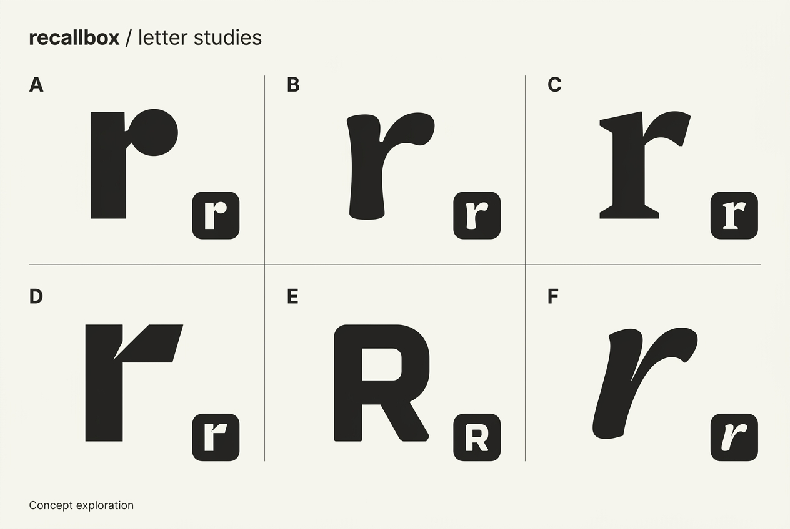

# Recallbox brand reference

The selected direction is **B**, the soft lowercase **r** in the top-middle cell. `letter-studies.png` is the exact, unmodified generated concept sheet approved by the user. Keep it as a reference; do not replace it with a new generation.

The production mark should preserve B’s tapered stem and asymmetric curved shoulder. Use neutral off-white and charcoal for the app interface. Color can remain for deck identification and review grades.

The concept sheet is a visual reference, not a font or production icon asset. It is not evidence of trademark clearance.
